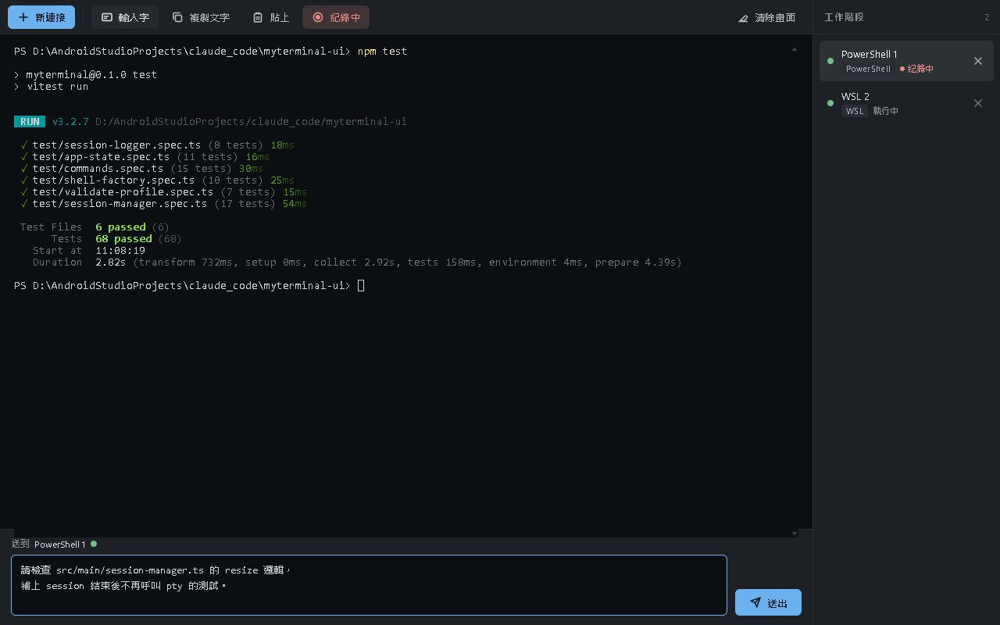

# myterminal

一個 Windows 桌面終端機管理員：在同一個視窗裡管理多個工作階段
（PowerShell、WSL、SSH、以及跑 `claude` / `codex` CLI 的 shell）。

介面草圖見 [`docs/UI.png`](docs/UI.png)：
上方藍色工具列、中間終端機、右側綠色 session 清單，一次只顯示一個終端機（沒有分割視窗）。



## 功能

工具列（由左至右）：

| 按鈕 | 行為 |
| --- | --- |
| 新連接 | 開啟新連接對話框，建立工作階段 |
| 輸入字 | 開關終端機下方的多行輸入區，「送出」會把整段內容一次送進作用中的工作階段（用來寫給 Claude / Codex 的長訊息） |
| 複製文字 | 複製終端機中選取的文字 |
| 貼上 | 把剪貼簿內容送進作用中的工作階段 |
| 紀錄 | 開關輸出紀錄，記錄中按鈕會變紅並顯示「紀錄中」 |
| 清除畫面 | 清空目前的終端機 |

右側 session 清單每一列是一個工作階段：名稱、類型標籤、執行中／已結束狀態、✕ 關閉。
點擊該列即可切換顯示的終端機。

紀錄檔會寫到 `%USERPROFILE%\myterminal-logs\<工作階段名稱>-<時間戳>.log`。

## 支援的工作階段類型

| 類型 | 實際執行 |
| --- | --- |
| PowerShell | `powershell.exe -NoLogo` |
| WSL | `wsl.exe`（可指定發行版與 `--cd` 目錄） |
| SSH (plink) | `plink.exe -ssh -P <port> <user>@<host>` |
| Claude | 基礎 shell（PowerShell 或 WSL）開起來後送出 `claude` |
| Codex | 基礎 shell 開起來後送出 `codex` |
| 自訂命令 | 自行指定執行檔與參數 |

Claude / Codex 的啟動指令可以在對話框裡改（例如加參數）。

## 前置需求

- Windows 10 / 11
- Node.js 20 以上（開發用；本專案在 Node 24 上開發）
- 依你要用的類型另外需要：
  - WSL：已安裝的發行版
  - SSH：[PuTTY](https://www.putty.org/) 的 `plink.exe`
    （會找 `C:\Program Files\PuTTY\plink.exe`，找不到就改走 PATH）
  - Claude / Codex：`claude` 或 `codex` 要在 PATH 上

`node-pty` 內附 `win32-x64` 的預先建置檔，搭配本專案釘住的 `electron@44.2.0`
不需要 `electron-rebuild`。

## 指令

```bash
npm install      # 安裝相依套件
npm run dev      # 開發模式（electron-vite，支援熱更新）
npm test         # 單元測試（Vitest）
npm run build    # 建置到 out/
npm run e2e      # 先 build 再跑 Playwright 冒煙測試，截圖寫到 test-results/smoke.png
npm run dist     # 打包成 Windows 執行檔（electron-builder）
```

## 打包成執行檔

```bash
npm run dist
```

先跑 `electron-vite build`，再交給 `electron-builder --win`，產物都在 `dist/`：

| 檔案 | 說明 |
| --- | --- |
| `myterminal-<版本>-portable.exe` | 免安裝單檔，雙擊就跑 |
| `myterminal-<版本>-setup.exe` | NSIS 安裝檔，安裝到目前使用者（不需要系統管理員），會建立桌面與開始功能表捷徑，並可從「應用程式與功能」移除 |
| `dist/win-unpacked/` | 未壓縮的目錄版，開發時最方便直接測 |

打包設定在 [`electron-builder.yml`](electron-builder.yml)。`dist/` 已經在 `.gitignore` 裡，不要 commit 產物。

注意事項：

- **`npmRebuild: false`**：electron-builder 預設會用 `@electron/rebuild` 從原始碼重建原生模組，
  在沒有裝 Visual Studio 的機器上會直接失敗。`node-pty` 1.1.0 本來就內附
  `win32-x64` 預先建置檔且與 `electron@44.2.0` 的 ABI 相容，所以關掉重建。
- **`asarUnpack: node_modules/node-pty/**`**：`pty.node`、`conpty.dll`、`OpenConsole.exe`
  以及 node-pty 會 fork 出來的 `conpty_console_list_agent.js` 都必須是真實檔案，
  留在 asar 裡會載入失敗。
- **portable 版第一次啟動要等**：單檔 exe 會先把約 250 MB 的內容解壓到
  `%TEMP%\<亂數目錄>\` 再啟動，實測從啟動到視窗出現約 30～60 秒（之後關掉會自己清乾淨）。
  安裝版與 `win-unpacked` 沒有這段等待。
- **沒有簽章、沒有自訂圖示**：用 Electron 預設圖示；未簽章的 exe 第一次執行
  Windows SmartScreen 會跳警告，選「仍要執行」即可。

`e2e/packaged.spec.ts` 會用 `dist/win-unpacked/myterminal.exe` 重跑一次冒煙測試，
確認 asar 外面的 node-pty 真的能開出 PowerShell；沒有打包過的話這個測試會自動 skip。

## 怎麼加一種新的工作階段類型

架構刻意把「類型知識」集中在少數幾個地方，加一種新類型只要動這四處：

1. `src/shared/profile.ts`：在 `ConnectionProfile` 判別聯集加一個成員，
   並在 `TYPE_LABELS` 補上顯示名稱。
2. `src/main/shell-factory.ts`：在 `create()` 的 `switch` 加一個 `case`，
   回傳 `{ file, args, cwd, env, startupCommand? }`。TypeScript 會強迫你補齊。
3. `src/shared/validate-profile.ts`：如果有必填欄位就加驗證規則。
4. `src/renderer/index.html` + `new-connection-dialog.ts`：
   在 `<select id="f-type">` 加一個選項，需要額外欄位就加一組
   `<div class="field-group" data-for="...">` 並在 `GROUP_FOR` 對應上去。

`SessionManager`、IPC、renderer 的其他部分都不必改。

架構細節見 [`docs/ARCHITECTURE.md`](docs/ARCHITECTURE.md)。
