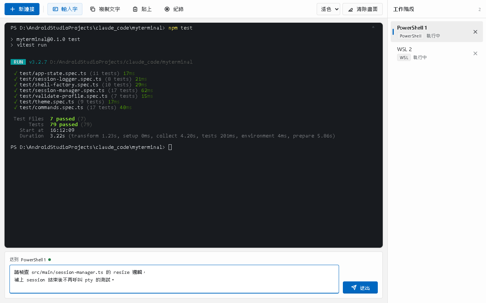
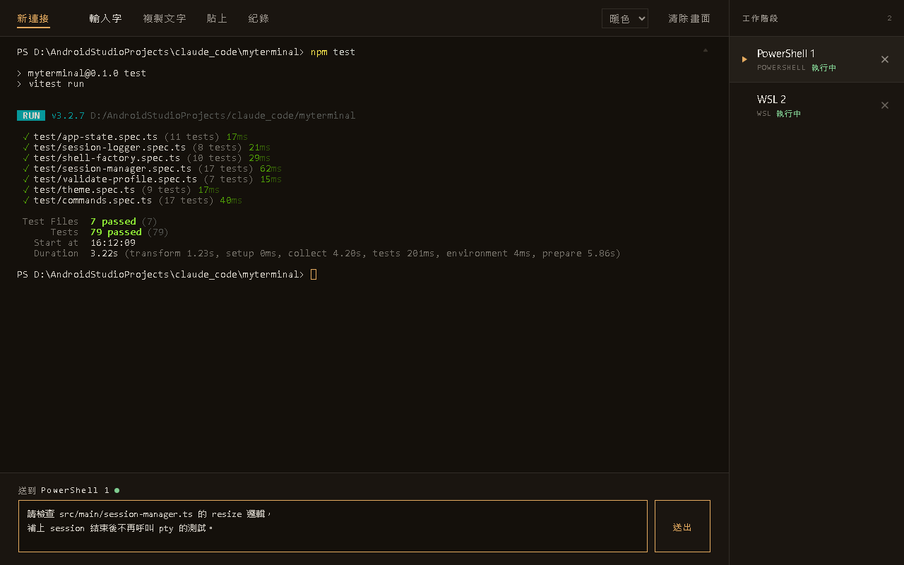
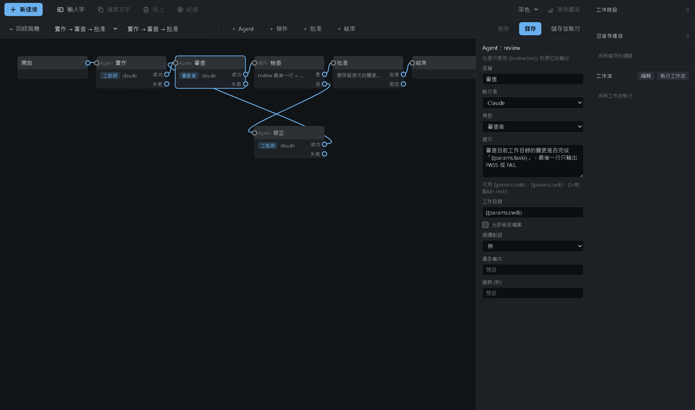

# myterminal

一個 Windows 桌面終端機管理員：在同一個視窗裡管理多個工作階段
（PowerShell、WSL、SSH、以及跑 `claude` / `codex` CLI 的 shell）。

介面見 [`docs/UI.png`](docs/UI.png)：
深色工作台風格，上方工具列、中間終端機、右側工作階段清單，一次只顯示一個終端機（沒有分割視窗）。


## 功能

工具列（由左至右）：

| 按鈕 | 行為 |
| --- | --- |
| 新連接 | 開啟新連接對話框，建立工作階段 |
| 輸入字 | 開關終端機下方的多行輸入區（用來寫給 Claude / Codex 的長訊息）。「送出」把整段內容走**終端機的貼上路徑**送進去，再補一個 Enter：多行是一整段進去的，PowerShell 收到的是一段多行緩衝區（那個 Enter 一次把它們都執行），Claude / Codex 的 TUI 收到的是一段多行提示 |
| 複製文字 | 複製終端機中選取的文字 |
| 貼上 | 把剪貼簿內容用終端機的貼上路徑送進作用中的工作階段（換行歸一化、對方支援的話加上 bracketed paste 標記），貼完自己按 Enter 才執行 |
| 紀錄 | 開關輸出紀錄，記錄中按鈕會變紅並顯示「紀錄中」。已結束的工作階段不會再有輸出，所以這顆按鈕是灰的 |
| 主題 | 下拉選單，切換深色／淺色／暖色，見下面的「主題」 |
| 清除畫面 | 清空目前的終端機 |

視窗最小是 900×560 —— 再小工具列右邊的按鈕就被擠出畫面了。

右側 session 清單每一列是一個工作階段：名稱、類型標籤、執行中／已結束狀態、✕ 關閉。
點擊該列即可切換顯示的終端機。清單下方是「已儲存連線」與「工作流」，見下面的
[已儲存連線](#已儲存連線)與[工作流](#工作流)。面板最下面一行是兩支 CLI 現在的
登入方式（例如 `Claude · Max 訂閱`、`Codex · ChatGPT 訂閱`），app 啟動時問一次。

紀錄檔會寫到 `%USERPROFILE%\myterminal-logs\<工作階段名稱>-<時間戳>.log`
（時間戳是**當地時間**的 `YYYYMMDD-HHmmss`）。
設了環境變數 `MYTERMINAL_LOG_DIR` 就改寫到那個目錄（e2e 用它把紀錄檔隔離開來）。

## 主題

工具列右邊的下拉選單可以切換三種主題，選好之後會記在 `localStorage`
（key 是 `myterminal.theme`），下次開啟時直接套用：

| 主題 | 樣子 |
| --- | --- |
| 深色 | 預設。冷調中性深色面板 + 藍色重點色，見上圖 |
| 淺色 | Fluent 風格的淺灰視窗，終端機縮成一張有外框的深色卡片 |
| 暖色 | 暖炭底 + 琥珀色，零圓角、只有髮絲線，工具列是純文字 |





暖色的設計稿原本用 IBM Plex，但 renderer 的 CSP 是 `default-src 'self'`
而且離線也要能用，所以不載入 Google Fonts，改用系統字型
（介面 `Segoe UI Variable Text`、等寬 `Cascadia Mono`），
暖味靠顏色、字距與髮絲線撐住。

## 已儲存連線

像 PuTTY 的 Saved Sessions：常用的連線存起來，之後點一下就開。

新連接對話框最下面有一個「儲存此連線設定」。勾起來之後**名稱變成必填**
（沒填會顯示「儲存設定時必須填名稱」），按「建立」時除了照常開出工作階段，
還會把這次填的內容存成一筆設定，出現在右側清單下方的「已儲存連線」。
不勾就跟以前一樣，只開工作階段、不留下任何東西。

| 動作 | 怎麼做 |
| --- | --- |
| 連線 | 點一下那一列，用同一份設定開一個新的工作階段 |
| 刪除 | 滑過那一列會出現 ✕，按下去確認後刪除 |
| 修改 | **沒有編輯畫面**：刪掉再存一次就好，存同名的會直接覆蓋原本那筆 |

存的就是對話框裡填的東西：類型、名稱、工作目錄，加上該類型自己的欄位
（SSH 的主機／連接埠／使用者、WSL 的發行版、Claude / Codex 的基礎 shell
與啟動指令、自訂命令的執行檔與參數）。**不會存密碼**——SSH 一樣是
`plink.exe` 在終端機裡問你。

檔案是 `%APPDATA%\myterminal\profiles.json`（Electron 的 userData 目錄），
一個陣列，名稱是主鍵（區分大小寫）。可以直接用編輯器改；
萬一改壞了（不是合法 JSON、或某一筆少了名稱），那一筆會被忽略，
最壞的情況是清單變空的，app 不會因此開不起來。

## Agent 任務（spike）

「新連接」選 **Agent 任務**，填一段任務給 `claude` 或 `codex`，
它會用**無介面模式**跑一次，跑完就結束 —— 不是開一個可以打字的 CLI，
而是「送出一個任務，看它做完」。畫面上它就是一個普通的工作階段：

```
[claude] 任務：只回覆 AGENT_E2E_OK，不要做別的事
AGENT_E2E_OK
✔ 完成 · 2.4 s · ≈$0.091 · session fe91027d…
```

助理的文字照原樣印，用到工具會多一行 `⚙ Read src/x.ts`，
最後一行是結果、花的時間、用掉多少（見下面的注意事項）與 CLI 那邊的 session id。

| 欄位 | 說明 |
| --- | --- |
| 執行者 | Claude 或 Codex |
| 角色 | 產品經理／架構師／工程師／測試工程師／審查者，選了就在任務前面加一段前置指示（Claude 走 `--append-system-prompt`，Codex 接在提示前面）。換角色時「允許修改檔案」會跟著跳到那個角色的預設值。留「無」就沒有 |
| 任務 | 要它做什麼（多行沒問題，是用 stdin 送進去的） |
| 工作目錄 | 留空的話用家目錄 |
| 允許修改檔案 | **預設關閉**。關著是 Claude 的 `plan` 模式／Codex 的 `read-only` 沙箱（會讀、會回答，但不能寫）；打開才是 `acceptEdits`／`workspace-write` |

注意事項：

- **金額跟任務大小幾乎無關** —— 一句「只回覆 OK」實測就是 $0.07～0.09
  （大部分是冷啟動建立快取的用量）。
- **那個金額是不是錢，要看登入方式**。用**訂閱**登入（這台機器的 `claude` 是
  claude.ai Max、`codex` 是 ChatGPT）時，CLI 回報的 `total_cost_usd` 只是依 token
  用量估算的 **API 等值金額**，不另外收費，只算進方案的用量上限 —— 所以畫面上寫成
  `≈$0.091`。用 API 金鑰登入才是真的帳單，那時就直接寫 `$0.091`。
  金額滑過去有一句說明。
- **要先登入**：`claude` 用 `claude` 自己的登入，`codex` 用 `codex login`。
  沒登入就會在終端機裡看到 `✘ 失敗：…`。右側面板最下面那一行就是 app 開機時
  問出來的結果（`claude auth status` 與 `codex login status`），
  沒登入或找不到指令也會寫在那裡。
- **接手**：任務跑起來之後，右側那一列滑過去會出現「接手」。
  按下去會開一個**真的互動式**工作階段（PowerShell 裡跑 `claude --resume <id>`，
  Codex 是 `codex resume <id>`），接著同一段對話繼續問下去。
  app 裡的 agent 任務本身不能追問，追問就是用接手。
- 這一頁的任務也可以像其他類型一樣勾「儲存此連線設定」存起來重複用。

實測到的東西（命令、事件格式、延遲、Windows 的坑、還沒解決的風險）寫在
[`docs/AGENT-SPIKE.md`](docs/AGENT-SPIKE.md)。這一頁是**單一一次執行**：
送出去、看它做完就結束。要多步驟、分支與人工批准，看下面的[工作流](#工作流)。

## 工作流

把「跑一次 agent」串成「跑一串 agent，中間可以分支、可以問人」。
右側清單最下面那一段就是它：按「執行工作流」選一個工作流、填任務與工作目錄就開始跑。

**每個工作流都跑在 LangGraph 上**（`@langchain/langgraph`）——
一份 JSON 定義編譯成真的 `StateGraph`，沒有自己寫的排程器。
JSON schema、節點型別、怎麼加一種新節點，見
[`docs/WORKFLOW.md`](docs/WORKFLOW.md)。

自己的工作流不必手寫 JSON：右側「工作流」那一列的**「編輯」**會打開一張
**LabVIEW 風格的畫布**——從上面的調色盤放下 Agent／條件／批准／結束節點，
拖到想要的位置，從節點右側的出口（成功／失敗、是／否、批准／退回）拉一條線到
另一個節點左側的入口就是一條連線，右側的屬性面板設每個 agent 節點的執行者
（claude／codex）、角色與提示。按「儲存」就是一份跟內建範本同格式的自訂工作流
（存進 `%APPDATA%\myterminal\workflows.json`），「儲存並執行」則是存完直接開
執行對話框。用法與規則見 [`docs/WORKFLOW.md`](docs/WORKFLOW.md) 的「畫布編輯器」。



內建範本只有一個 **「實作 → 審查 → 批准」**（自己存的工作流放在
`%APPDATA%\myterminal\workflows.json`，跟範本同一種格式，見
[`docs/WORKFLOW.md`](docs/WORKFLOW.md) 的「自訂工作流的儲存」）：

```
開始 → 實作 ──ok──→ 審查 ──ok──→ 檢查 ──PASS──→ 批准 ──批准──→ 結束
                       ↑                │
                       └──── 修正 ←─FAIL─┘
```

| 節點 | 做什麼 |
| --- | --- |
| 實作 | `claude`，**工程師**角色，**允許修改檔案**，提示就是你填的任務 |
| 審查 | `claude`，**審查者**角色，唯讀，看工作目錄的變更有沒有完成任務，最後一行只輸出 `PASS` 或 `FAIL` |
| 檢查 | 看審查輸出的最後一行是不是 `PASS` |
| 修正 | `claude`，工程師角色，允許修改檔案，**接續「實作」那段對話**，帶著審查意見重做，最多三次 |
| 批准 | 停下來問你「要保留這次的變更嗎？」 |

agent 節點可以指定**角色**（產品經理／架構師／工程師／測試工程師／審查者）——
一段可以重複用的系統提示前言，清單上那一列會貼一個角色標籤。
五個角色各自的職責與預設權限見
[`docs/WORKFLOW.md`](docs/WORKFLOW.md) 的「角色」。

每個 agent 節點在畫面上就是**一個普通的工作階段**（名字是「實作 → 審查 → 批准 · 實作」），
有終端機、可以開紀錄、也可以「接手」。工作流清單裡點節點那一列就切到它的終端機。

清單上每個執行顯示名稱、狀態（執行中／等待批准／完成／失敗／已取消）、累計用量
（訂閱帳號是估算，所以寫成 `≈$0.175`），以及一列一個節點的狀態點。
等待批准時出現問題與「批准」「退回」，執行中出現「取消」。

注意事項：

- **會用掉方案的用量**。一次順利的執行是兩次 `claude` 呼叫（實作 + 審查），
  實測估算 **≈$0.175**；審查沒過每多繞一圈再加兩次。
  執行對話框有一欄**「用量上限（估算美元）」**，**留空就是不限制** ——
  只有 CLI 是用 API 金鑰登入時才會預先填 $2（那時金額才是真的帳單）。
  有填而且超過的話，那個節點會被標成失敗並收尾。
- **每個節點有逾時**，預設 600 秒，超過就取消那次 CLI 執行，節點算失敗。
- **迴圈有上限**：「修正」最多三次，用完就結束並把執行標成失敗。
- **批准可以放著**：等待批准的執行存在 LangGraph 的 checkpoint 檔
  （`%APPDATA%\myterminal\workflow-runs\<執行 id>.json`），
  **關掉 app 再開，那筆執行還在清單上，按「批准」就繼續跑**（已實測）。
  反過來，關掉 app 時還在「執行中」的接不回去（CLI 行程已經沒了），會標成失敗。
- **工作目錄是必填的**：這個範本的 agent 真的會改檔案，不能讓它掉進家目錄。
  Windows 上**不要填 8.3 短路徑**（`C:\Users\ROBERT~1\...`）：`claude` 會把它當成
  可疑路徑要求手動核准，而無介面模式核准不了，結果是 agent 什麼檔案都寫不出來。
  見 [`docs/WORKFLOW.md`](docs/WORKFLOW.md) 的「Windows 上的坑」。
- Codex 的節點走的是同一條 `IAgentRunner`；2026-09-14 用 ChatGPT 訂閱實測可以跑，
  見 [`docs/AGENT-SPIKE.md`](docs/AGENT-SPIKE.md) 的「2026-09-14 更新」。

## 支援的工作階段類型

| 類型 | 實際執行 |
| --- | --- |
| PowerShell | `powershell.exe -NoLogo` |
| WSL | `wsl.exe`（可指定發行版與 `--cd` 目錄） |
| SSH (plink) | `plink.exe -ssh -no-antispoof -P <port> <user>@<host>`，見下面的「SSH 連線」 |
| Claude | 基礎 shell（PowerShell 或 WSL）開起來後送出 `claude` |
| Codex | 基礎 shell 開起來後送出 `codex` |
| 自訂命令 | 自行指定執行檔與參數（參數以空白分隔，雙引號裡的空白會保留，`\"` 是一個引號） |
| Agent 任務 | `claude -p --output-format stream-json` 或 `codex exec --json` 跑一次，見上面的「Agent 任務」 |

Claude / Codex 的啟動指令可以在對話框裡改（例如加參數）。

## SSH 連線

「新連接」選 SSH，填主機、連接埠、使用者，實際 spawn 出來的是：

```
plink.exe -ssh -no-antispoof -P <port> <user>@<host>
```

- **刻意不加 `-batch`**：主機金鑰確認、密碼這些提示要能顯示在終端機裡讓你回答。
- **`-no-antispoof`**：在 ConPTY 底下 plink 會認為終端機不可信，密碼過了之後多印一行
  `Access granted. Press Return to begin session.`，並把你打的**第一行整個吃掉**
  當成那個 Return（打 `ls` 會什麼都不做，也不會有回應）。加上這個參數就沒有那一步，
  代價是關掉 PuTTY 的防偽提示保護。
- 密碼不由本程式處理：plink 自己問，你直接打進終端機。
  （plink 預設會先試 Pageant 與金鑰，都不成才問密碼。）

第一次連某台主機時 plink 會先問金鑰：

```
The host key is not cached for this server:
  localhost (port 2222)
...
Store key in cache? (y/n, Return cancels connection, i for more info)
```

打 `y` + Enter，金鑰會存進 `HKCU\Software\SimonTatham\PuTTY\SshHostKeys`，
之後連同一台就直接跳到 `<user>@<host>'s password:`。

### 本機 SSH 測試環境

`e2e/ssh.spec.ts` 要有一台真的 sshd 才跑得動。`scripts/wsl-sshd-setup.sh` 會在 WSL 裡開一台
（可重複執行）：

```bash
wsl.exe -u root -e bash scripts/wsl-sshd-setup.sh
```

用 `wsl.exe -u root` 是因為它不需要密碼，所以腳本裡不用 `sudo`。它會動到 WSL 的這些東西：

| 動作 | 內容 |
| --- | --- |
| 安裝套件 | `openssh-server` |
| 停用 systemd 單元 | `ssh.socket`、`ssh.service`、`sshd.service`。Ubuntu 24.04 之後預設 socket activation，`ssh.socket` 把 22 寫死在 unit 裡，`sshd_config` 的 `Port` 會被無視，所以改用獨立的 sshd 行程 |
| 新增設定檔 | `/etc/ssh/sshd_config.d/myterminal-e2e.conf`：`Port 2222`、`ListenAddress 127.0.0.1`、`PasswordAuthentication yes`、`PermitRootLogin no` |
| 新增帳號 | 本機帳號 `mtssh`，密碼 `mtssh-e2e`。**這是拋棄式的測試帳號**，只存在於這台 WSL，測完就該刪掉 |
| 啟動 | `/usr/sbin/sshd`（獨立行程，不經 systemd） |

綁 `127.0.0.1` 就夠：WSL2 NAT 模式的 localhost forwarding 會把 Windows 的
`localhost:2222` 轉進 WSL（已實測），不必為了測試對 LAN 開放。

跑測試：

```bash
npm run e2e:ssh
```

用完還原：

```bash
wsl.exe -u root -e bash scripts/wsl-sshd-teardown.sh            # 停 sshd、刪設定檔與 mtssh
wsl.exe -u root -e bash scripts/wsl-sshd-teardown.sh --purge    # 連 openssh-server 一起移除
```

不加 `--purge` 的話 `openssh-server` 會留著，systemd 的 ssh 單元維持在停用狀態
（這台機器本來就沒在跑 sshd，所以腳本不會自作主張把它們打開）。

## 前置需求

- Windows 10 / 11
- Node.js 20 以上（開發用；本專案在 Node 24 上開發）
- 依你要用的類型另外需要：
  - WSL：已安裝的發行版
  - SSH：[PuTTY](https://www.putty.org/) 的 `plink.exe`
    （會找 `C:\Program Files\PuTTY\plink.exe`，找不到就改走 PATH）
  - Claude / Codex：`claude` 或 `codex` 要在 PATH 上

`node-pty` 內附 `win32-x64` 的預先建置檔，搭配本專案釘住的 `electron@44.2.0`
不需要 `electron-rebuild`。

## 指令

```bash
npm install      # 安裝相依套件
npm run dev      # 開發模式（electron-vite，支援熱更新）
npm test         # 單元測試（Vitest）
npm run build    # 建置到 out/
npm run e2e      # 先 build 再跑 Playwright 端到端測試（冒煙、設定檔、主題、畫布編輯器），截圖寫到 test-results/
npm run e2e:ssh  # SSH 端到端測試，要先開好本機 sshd，見「本機 SSH 測試環境」
npm run e2e:agent # Agent 任務端到端測試，會真的呼叫 claude / codex（要登入、會花錢）
npm run e2e:workflow # 工作流範本端到端測試，會真的呼叫 claude（要登入、會花錢）
npm run dist     # 打包成 Windows 執行檔（electron-builder）
```

## 打包成執行檔

```bash
npm run dist
```

先跑 `electron-vite build`，再交給 `electron-builder --win`，產物都在 `dist/`：

| 檔案 | 說明 |
| --- | --- |
| `myterminal-<版本>-portable.exe` | 免安裝單檔，雙擊就跑 |
| `myterminal-<版本>-setup.exe` | NSIS 安裝檔，安裝到目前使用者（不需要系統管理員），會建立桌面與開始功能表捷徑，並可從「應用程式與功能」移除 |
| `dist/win-unpacked/` | 未壓縮的目錄版，開發時最方便直接測 |

打包設定在 [`electron-builder.yml`](electron-builder.yml)。`dist/` 已經在 `.gitignore` 裡，不要 commit 產物。

注意事項：

- **`npmRebuild: false`**：electron-builder 預設會用 `@electron/rebuild` 從原始碼重建原生模組，
  在沒有裝 Visual Studio 的機器上會直接失敗。`node-pty` 1.1.0 本來就內附
  `win32-x64` 預先建置檔且與 `electron@44.2.0` 的 ABI 相容，所以關掉重建。
- **`asarUnpack: node_modules/node-pty/**`**：`pty.node`、`conpty.dll`、`OpenConsole.exe`
  以及 node-pty 會 fork 出來的 `conpty_console_list_agent.js` 都必須是真實檔案，
  留在 asar 裡會載入失敗。
- **portable 版第一次啟動要等**：單檔 exe 會先把約 250 MB 的內容解壓到
  `%TEMP%\<亂數目錄>\` 再啟動，實測從啟動到視窗出現約 30～60 秒（之後關掉會自己清乾淨）。
  安裝版與 `win-unpacked` 沒有這段等待。
- **沒有簽章、沒有自訂圖示**：用 Electron 預設圖示；未簽章的 exe 第一次執行
  Windows SmartScreen 會跳警告，選「仍要執行」即可。

`e2e/editor.spec.ts` 是畫布編輯器的端到端：加一個 agent 節點、設角色、用滑鼠把
三個節點接起來、儲存，再確認執行對話框的「自訂」分組看得到它。它不呼叫任何 CLI，
所以不花錢，跟冒煙測試一樣屬於預設的 `npm run e2e`（截圖在 `test-results/editor.png`）。

`e2e/packaged.spec.ts` 會用 `dist/win-unpacked/myterminal.exe` 重跑一次冒煙測試，
確認 asar 外面的 node-pty 真的能開出 PowerShell；沒有打包過的話這個測試會自動 skip。

## 怎麼加一種新的工作階段類型

架構刻意把「類型知識」集中在少數幾個地方，加一種新類型只要動這五處：

1. `src/shared/profile.ts`：在 `ConnectionProfile` 判別聯集加一個成員，
   並在 `TYPE_LABELS` 補上顯示名稱。
2. `src/main/shell-factory.ts`：在 `create()` 的 `switch` 加一個 `case`，
   回傳 `{ file, args, cwd, env, startupCommand? }`。TypeScript 會強迫你補齊。
3. `src/shared/validate-profile.ts`：如果有必填欄位就加驗證規則。
4. `src/renderer/index.html` + `new-connection-dialog.ts`：
   在 `<select id="f-type">` 加一個選項，需要額外欄位就加一組
   `<div class="field-group" data-for="...">` 並在 `GROUP_FOR` 對應上去。
5. `src/renderer/profile-list-view.ts`：`profileMeta()` 的 `switch` 加一個 `case`，
   決定「已儲存連線」那一列要顯示什麼。TypeScript 一樣會強迫你補齊。

`SessionManager`、IPC、renderer 的其他部分都不必改。

唯一的例外是 **Agent 任務**：它不開 shell，所以不走 `ShellFactory`，
而是由 `SessionManager` 交給 `IAgentRunner`，見
[`docs/ARCHITECTURE.md`](docs/ARCHITECTURE.md) 的「Agent 任務」。

架構細節見 [`docs/ARCHITECTURE.md`](docs/ARCHITECTURE.md)。
