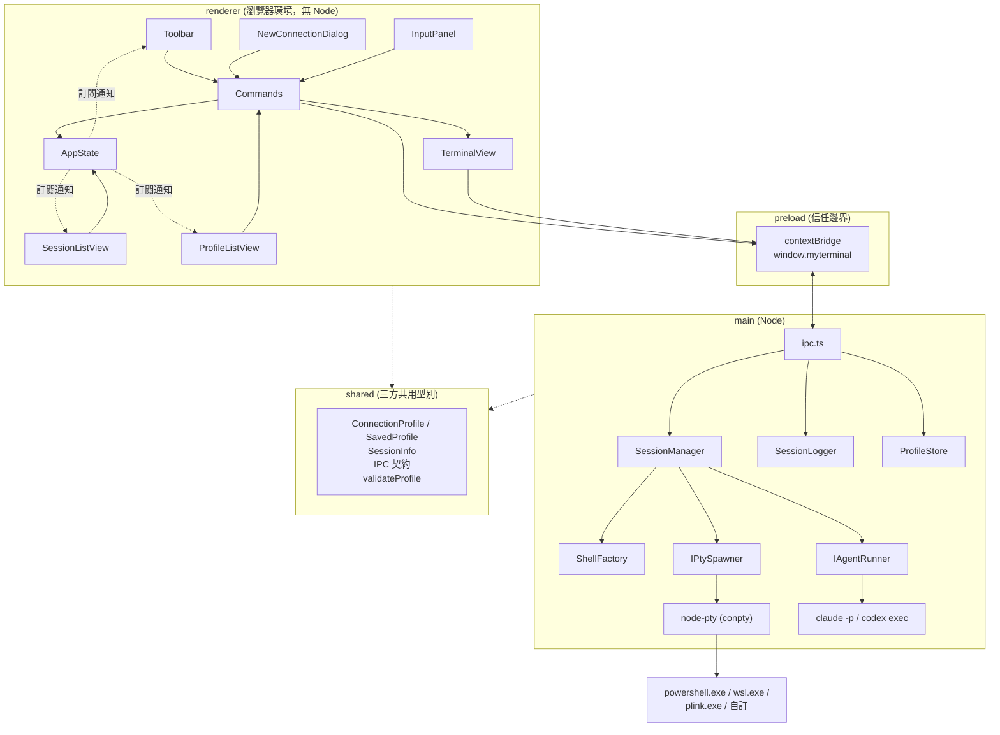
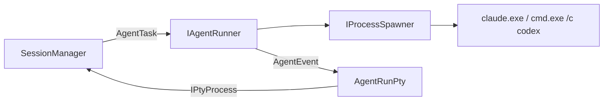

# 架構

介面：[`UI.png`](UI.png)

## 分層

三層各自獨立建置（`electron-vite` 的 main / preload / renderer），
共用 `src/shared/` 的型別。

安全設定：`contextIsolation: true`、`nodeIntegration: false`、
沿用 Electron 預設的 sandbox（preload 建置成 CJS 因此相容）。
renderer 拿不到 `ipcRenderer` 也拿不到 Node，只看得到 `preload` 白名單過的
`MyTerminalApi`。

## 使用的設計模式

| 模式 | 位置 | 為什麼 |
| --- | --- | --- |
| **Factory Method** | `main/shell-factory.ts` | 「哪一種連線要 spawn 什麼」是唯一會隨類型增長的知識，集中在一個 `switch`。判別聯集讓 TypeScript 在漏掉新類型時直接編譯失敗。 |
| **Adapter** | `main/pty.ts`（介面）、`main/node-pty-spawner.ts`（實作）、`main/agent-runner.ts` + `main/agent-run-pty.ts`（見下面的「Agent 任務」） | node-pty 是原生模組、要真的開行程，直接依賴它整個 main 就沒辦法測。抽成 `IPtySpawner` / `IPtyProcess` 之後，測試注入 `FakePtySpawner` 就行。這也是唯一吞掉 node-pty Windows 後端例外的地方。 |
| **Dependency Injection** | `SessionManager`、`SessionLogger`、每個 `Command` 的建構子 | 所有跟外界（行程、檔案系統、剪貼簿、DOM）接觸的東西都從建構子傳進來，預設值是正式實作，測試傳假的。 |
| **Observer** | `SessionManager`（typed `EventEmitter`）、`AppState`（`subscribe`） | main 端 pty 的輸出是推送式的；renderer 端多個 View 要對同一份狀態反應。兩邊都用訂閱而不是互相持有參考。 |
| **Decorator / Observer** | `main/session-logger.ts` | 紀錄功能掛在 `SessionManager` 的 `data` 事件上，不改變資料流本身，也不需要 `SessionManager` 知道紀錄這回事。 |
| **Repository** | `main/profile-store.ts` | 已儲存的連線設定就是一份 JSON，`list` / `save` / `remove` 三個方法把「存在哪、怎麼序列化、檔案壞了怎麼辦」包在裡面。IPC 與 renderer 只看得到 `SavedProfile[]`，換成別的儲存方式不會影響到它們。 |
| **Command** | `renderer/commands.ts` | 工具列七個按鈕各是一個 `ICommand`。按鈕只負責「按下去就 `execute()`」，行為本身不碰 DOM，可以單獨測試。 |

刻意**沒有**引入的東西：設定系統、外掛架構、狀態管理框架、UI 框架。
renderer 是純 TypeScript + DOM。

## 主題

`styles.css` 只有一份元件規則，顏色／圓角／邊框／版面尺寸全部是 CSS custom
property：`:root`（等同 `html[data-theme="dark"]`）是深色，
`html[data-theme="light"]` 與 `["warm"]` 只覆寫 token，沒有任何元件規則被複製第二遍。
極少數 token 表達不了的差異（淺色與暖色只在作用中那列顯示指示器）才用
`data-theme` 選擇器寫成兩行。

`renderer/theme.ts` 是另一半：`THEMES` 放三個主題的中文名稱與 xterm 的
`ITheme`（xterm 畫在 canvas 上，吃不到 CSS 變數，只能用 JS 給顏色），
`ThemeStore` 則是跟 `AppState` 同一個 Observer 寫法，多了持久化 ——
`Storage` 與「套用主題」的動作都從建構子注入，正式環境是 `window.localStorage`
與 `document.documentElement.dataset.theme`，測試傳假的，所以 vitest 的 node
環境不需要 DOM 就測得到（`test/theme.spec.ts`）。讀不到或讀壞的值一律退回深色。
`main.ts` 第一件事就是建立 `ThemeStore`，主題因此在第一次繪製前就套上；
每個 `TerminalView` 都訂閱它，換主題時更新自己的 `terminal.options.theme`。

## 已儲存連線 (ProfileStore)

`ProfileStore` 是 Repository，資料是 `join(app.getPath('userData'), 'profiles.json')`
這一個檔案，每次寫入都把整個陣列覆寫回去（設定檔數量是個位數，
不值得為了省 I/O 做增量寫入或快取）。

讀與寫是建構子注入的兩個函式 —— 正式環境由 `fileProfileStore(path)` 包上
`readFileSync` / `writeFileSync`，測試傳一個記憶體字串進去，所以
`test/profile-store.spec.ts` 不需要暫存目錄也不會有殘留檔案，
跟 `SessionLogger` 注入 `LogSinkFactory` 是同一個手法。

名稱是主鍵：前後空白去掉、區分大小寫、`save` 是 upsert（覆寫時保留原順序）。
`list()` 每次都重新讀檔，而且對壞資料很寬容 —— 檔案不存在、內容不是 JSON、
不是陣列、或某一筆缺名稱／類型，分別回傳空清單或跳過那一筆。
使用者是可以直接編輯這個檔案的，一個逗號打錯不該讓 app 開不起來。

renderer 端沒有第二份狀態：`AppState` 多存一份 `profiles`，
`profiles:changed` 一到就 `setProfiles()`，`ProfileListView` 跟
`SessionListView` 一樣訂閱同一個 `AppState` 重畫。
點一列時走的是 `main.ts` 裡同一個 `createSession()`，
所以「先量 cols/rows 再 spawn」的順序對兩個入口都成立。

## Agent 任務 (spike)

`ConnectionProfile` 的 `'agent'` 變體不是「開一個 shell」，而是「跑一次 CLI」：
`claude -p --output-format stream-json --verbose` 或 `codex exec --json`。
它是唯一**不經過 `ShellFactory`** 的型別。

兩層 Adapter，各自解決一件事：

| 介面 | 為什麼存在 |
| --- | --- |
| **`IAgentRunner` / `IAgentRun`** (`main/agent-runner.ts`) | 把「CLI 的旗標、JSONL、Windows 的 `.cmd` shim」關在一個地方，對外只有 `start(task)` 與 `init / text / tool / result / error` 五種事件。行程本身再透過 `IProcessSpawner` 注入，所以解析器可以用 `FakeProcessSpawner` 加上 `test/fixtures/` 裡真的抓下來的 JSONL 測，一毛錢都不用花。 |
| **`AgentRunPty`** (`main/agent-run-pty.ts`) | 把事件流裝成 `IPtyProcess` 的樣子（`onData` 給格式化過的文字、`onExit` 給離開碼、`kill` 等於取消）。 |

**為什麼要繞回 `SessionManager`**：因為這樣「一次 agent 執行」在系統裡就是一個普通的
工作階段 —— 右側清單、切換、關閉、輸出紀錄、`session:data` / `session:exit`
全部不必為它改一行。`SessionManager` 只多知道一件事：agent 的 pty 不是 spawn 出來的。
代價是 `write()` / `resize()` 變成 no-op（spike 沒有追問的介面），
人要追問就按「接手」，用既有的 Claude / Codex 型別開一個真的互動式工作階段
（`claude --resume <session_id>`），那條路完全沒有動到。

`SessionInfo` 為此多了三個可選欄位：`cwd`（接手要用同一個目錄）、
`agentKind`（清單標籤要分 Claude / Codex）、`agentSessionId`（CLI 回報之後才會有，
有了「接手」按鈕才出現）。`agentSessionId` 是在執行中途才知道的，
所以 `SessionManager` 多了一個 `updated` 事件推給 renderer。

實測記錄與決策見 [`AGENT-SPIKE.md`](AGENT-SPIKE.md)。

## IPC 契約

頻道名稱與 payload 型別都定義在 `src/shared/ipc.ts`，三邊共用同一份。

renderer → main（`ipcMain.handle`，全部回傳 Promise）：

| 頻道 | 參數 | 回傳 |
| --- | --- | --- |
| `session:create` | `{ profile, cols, rows }` | `SessionInfo` |
| `session:write` | `{ id, data }` | — |
| `session:resize` | `{ id, cols, rows }` | — |
| `session:close` | `id` | — |
| `session:list` | — | `SessionInfo[]` |
| `session:start-log` | `id` | 紀錄檔路徑 |
| `session:stop-log` | `id` | — |
| `profiles:list` | — | `SavedProfile[]` |
| `profiles:save` | `SavedProfile` | — |
| `profiles:remove` | `name` | — |

main → renderer（`webContents.send`）：

| 頻道 | payload | 何時送 |
| --- | --- | --- |
| `session:data` | `{ id, data }` | pty 有輸出 |
| `session:exit` | `{ id, exitCode }` | pty 結束 |
| `session:changed` | `SessionInfo[]` | 建立、關閉、結束、紀錄狀態改變、agent 回報 session id |
| `profiles:changed` | `SavedProfile[]` | 儲存或刪除設定檔之後 |

`ipc.ts` 只做轉接，沒有商業邏輯；所以「IPC 沒被測試」不代表邏輯沒被測試。

### 建立工作階段的順序

`cols` / `rows` 必須在 spawn 之前就決定，但要先有 xterm.js 的實例才量得到。
所以流程是：renderer 先建立 `TerminalView`（此時還沒有 id，輸入透過閉包回呼），
量出尺寸後才 `createSession`，拿到 id 再綁定。

另外 `session:changed`（`webContents.send`）與 `session:create` 的回覆
（`ipcMain.handle` 的 Promise）走的是不同的佇列，**兩邊都可能先到**：

- `session:changed` 先到：`terminals` 還沒有這個 view，所以 renderer 拿到 id 之後
  要再 `syncTerminals()` 一次。
- 回覆先到：`state.sessions` 還沒有這個 id，`syncTerminals()` 會把剛建好的 view
  當成殘留清掉。所以 renderer 拿到 `SessionInfo` 之後會先把它塞進 `AppState`
  （下一個 `session:changed` 會覆寫，內容一樣）。
- 同理，`session:data` 也可能比回覆先到（agent 任務的第一行標題就是同步發出的），
  所以 renderer 有一個 `pendingData`：認領不到 id 的輸出先存著，
  `TerminalView` 一登記就補寫進去。

## TDD 縫線（fakes）

| 被測單元 | 注入的假物件 | 檔案 |
| --- | --- | --- |
| `ShellFactory` | 假的 `ExecutableResolver`（回傳 `RESOLVED(name)`） | `test/shell-factory.spec.ts` |
| `SessionManager` | `FakePtySpawner` / `FakePty`，以及同步版的 `Scheduler` | `test/fakes/fake-pty.ts` |
| `SessionLogger` | 假的 `LogSinkFactory` 與固定時鐘 | `test/session-logger.spec.ts` |
| `ProfileStore` | 假的讀／寫函式（記憶體裡的一個字串） | `test/profile-store.spec.ts` |
| `AppState` | 不需要（純資料） | `test/app-state.spec.ts` |
| `ThemeStore` | 假的 `Storage`（兩個方法）與假的 `apply` | `test/theme.spec.ts` |
| 各 `Command` | `FakeTerminal` / `FakeClipboard` / `FakeInputPanel` + `vi.fn()` 的 api | `test/commands.spec.ts` |
| `validateProfile` | 不需要（純函式） | `test/validate-profile.spec.ts` |
| `ClaudeCodeRunner` / `CodexRunner` | `FakeProcessSpawner` + `test/fixtures/*.jsonl`（真的跑出來的輸出） | `test/agent-runner.spec.ts` |
| `AgentRunPty` | `FakeAgentRun` | `test/agent-run-pty.spec.ts` |

原則：**不測 node-pty 和 xterm.js 本身**，只測自己包在它們外面的邏輯。
真正會碰到它們的地方（`NodePtySpawner`、`TerminalView`）刻意寫得很薄，
由 `e2e/smoke.spec.ts` 這個 Playwright 測試涵蓋。

`Scheduler` 這個縫線的存在理由：Claude / Codex 的啟動指令要等 shell 起來才送
（否則會被還沒開始讀 stdin 的 shell 吃掉），正式環境是 `setTimeout(600ms)`，
測試注入同步執行讓斷言是決定性的。

## Windows 上的注意事項

- **WSL 的工作目錄走 `--cd` 而不是 spawn 的 `cwd`**：使用者填的通常是
  Linux 路徑，拿去當 Windows 行程的 cwd 會失敗。
- **SSH 刻意不加 `-batch`**：主機金鑰確認之類的提示要能顯示在終端機裡讓使用者回答。
- **SSH 要加 `-no-antispoof`**：ConPTY 下 plink 會多一道
  `Access granted. Press Return to begin session.`，並把使用者輸入的第一行整個
  吃掉當成那個 Return。細節見 README 的「SSH 連線」。
- **已結束的 pty 不能碰**：node-pty 的 Windows 後端在行程結束後呼叫
  `resize()` 會丟 `Cannot resize a pty that has already exited`，
  而且是從非同步回呼裡丟的，`ipcMain.handle` 攔不到，會變成主行程的錯誤對話框。
  因此 `SessionManager` 只把 `write` / `resize` 轉給 `running` 的工作階段，
  `NodePtySpawner` 再多一層 `exited` 旗標與 try/catch。
- **FitAddon 在容器隱藏時會量出 0 或 NaN**，這種尺寸同樣不能送進 conpty，
  `SessionManager.resize()` 會擋掉。
- **關窗之後 pty 的 exit 事件才會送達**，那時 `webContents` 已經銷毀，
  所以 `main/index.ts` 在 `closed` 時把 `win` 設回 `null` 並檢查 `isDestroyed()`。
- **關閉工作階段時 stderr 可能出現 `AttachConsole failed`**：這是 node-pty 自己
  fork 出來的 `conpty_console_list_agent.js` 在 shell 已經結束時印的，
  屬於 node-pty 內部的清理步驟，不是本專案的例外。
  `WindowsPtyAgent.kill()` 是**同步**呼叫 `_ptyNative.kill()` 的，
  不依賴那個 agent，所以 shell 仍會被正常終止（已實測沒有殘留行程）。
  純粹是雜訊，不影響功能。
