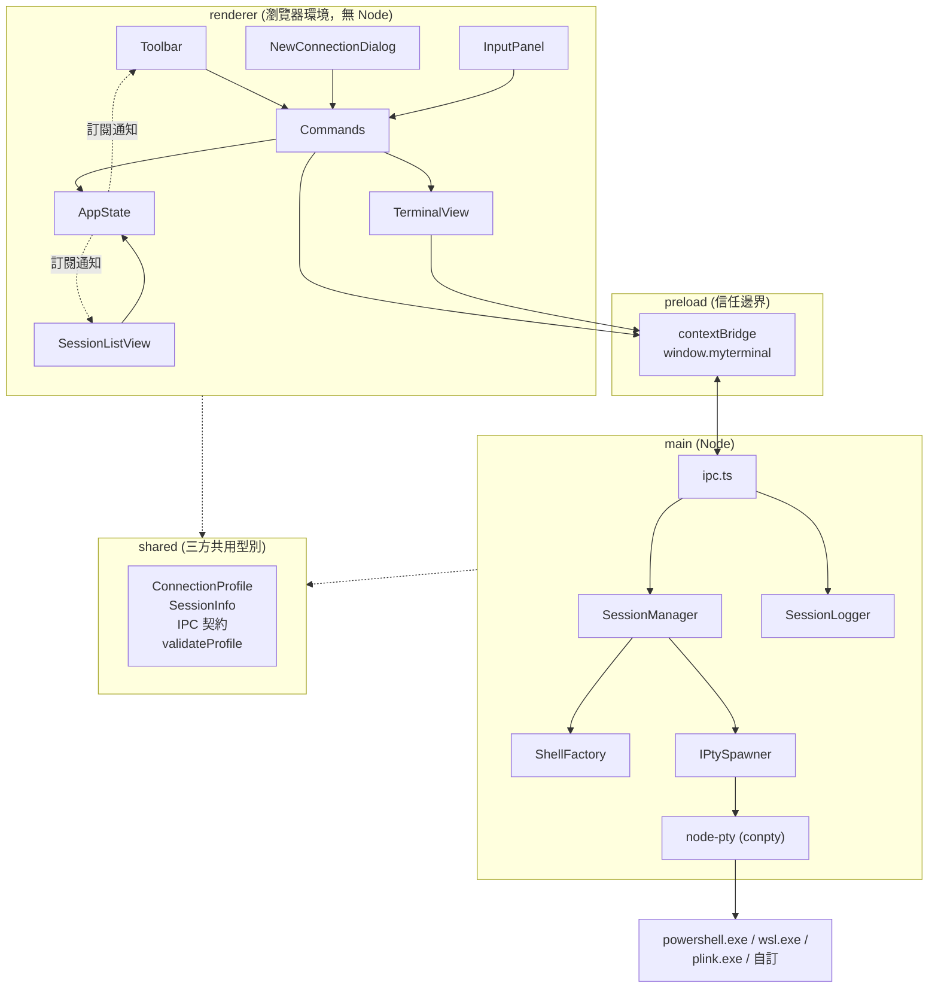

# 架構

介面草圖：[`UI.png`](UI.png)

## 分層

三層各自獨立建置（`electron-vite` 的 main / preload / renderer），
共用 `src/shared/` 的型別。

安全設定：`contextIsolation: true`、`nodeIntegration: false`、
沿用 Electron 預設的 sandbox（preload 建置成 CJS 因此相容）。
renderer 拿不到 `ipcRenderer` 也拿不到 Node，只看得到 `preload` 白名單過的
`MyTerminalApi`。

## 使用的設計模式

| 模式 | 位置 | 為什麼 |
| --- | --- | --- |
| **Factory Method** | `main/shell-factory.ts` | 「哪一種連線要 spawn 什麼」是唯一會隨類型增長的知識，集中在一個 `switch`。判別聯集讓 TypeScript 在漏掉新類型時直接編譯失敗。 |
| **Adapter** | `main/pty.ts`（介面）、`main/node-pty-spawner.ts`（實作） | node-pty 是原生模組、要真的開行程，直接依賴它整個 main 就沒辦法測。抽成 `IPtySpawner` / `IPtyProcess` 之後，測試注入 `FakePtySpawner` 就行。這也是唯一吞掉 node-pty Windows 後端例外的地方。 |
| **Dependency Injection** | `SessionManager`、`SessionLogger`、每個 `Command` 的建構子 | 所有跟外界（行程、檔案系統、剪貼簿、DOM）接觸的東西都從建構子傳進來，預設值是正式實作，測試傳假的。 |
| **Observer** | `SessionManager`（typed `EventEmitter`）、`AppState`（`subscribe`） | main 端 pty 的輸出是推送式的；renderer 端多個 View 要對同一份狀態反應。兩邊都用訂閱而不是互相持有參考。 |
| **Decorator / Observer** | `main/session-logger.ts` | 紀錄功能掛在 `SessionManager` 的 `data` 事件上，不改變資料流本身，也不需要 `SessionManager` 知道紀錄這回事。 |
| **Command** | `renderer/commands.ts` | 工具列七個按鈕各是一個 `ICommand`。按鈕只負責「按下去就 `execute()`」，行為本身不碰 DOM，可以單獨測試。 |

刻意**沒有**引入的東西：設定系統、主題、外掛架構、狀態管理框架、UI 框架。
renderer 是純 TypeScript + DOM。

## IPC 契約

頻道名稱與 payload 型別都定義在 `src/shared/ipc.ts`，三邊共用同一份。

renderer → main（`ipcMain.handle`，全部回傳 Promise）：

| 頻道 | 參數 | 回傳 |
| --- | --- | --- |
| `session:create` | `{ profile, cols, rows }` | `SessionInfo` |
| `session:write` | `{ id, data }` | — |
| `session:resize` | `{ id, cols, rows }` | — |
| `session:close` | `id` | — |
| `session:list` | — | `SessionInfo[]` |
| `session:start-log` | `id` | 紀錄檔路徑 |
| `session:stop-log` | `id` | — |

main → renderer（`webContents.send`）：

| 頻道 | payload | 何時送 |
| --- | --- | --- |
| `session:data` | `{ id, data }` | pty 有輸出 |
| `session:exit` | `{ id, exitCode }` | pty 結束 |
| `session:changed` | `SessionInfo[]` | 建立、關閉、結束、紀錄狀態改變 |

`ipc.ts` 只做轉接，沒有商業邏輯；所以「IPC 沒被測試」不代表邏輯沒被測試。

### 建立工作階段的順序

`cols` / `rows` 必須在 spawn 之前就決定，但要先有 xterm.js 的實例才量得到。
所以流程是：renderer 先建立 `TerminalView`（此時還沒有 id，輸入透過閉包回呼），
量出尺寸後才 `createSession`，拿到 id 再綁定。

另外 `session:changed` 通常比 `session:create` 的回覆更早到 renderer
（`manager.create()` 是同步發出 `created` 事件的），
所以 `renderer/main.ts` 在拿到 id 之後會再同步一次畫面。

## TDD 縫線（fakes）

| 被測單元 | 注入的假物件 | 檔案 |
| --- | --- | --- |
| `ShellFactory` | 假的 `ExecutableResolver`（回傳 `RESOLVED(name)`） | `test/shell-factory.spec.ts` |
| `SessionManager` | `FakePtySpawner` / `FakePty`，以及同步版的 `Scheduler` | `test/fakes/fake-pty.ts` |
| `SessionLogger` | 假的 `LogSinkFactory` 與固定時鐘 | `test/session-logger.spec.ts` |
| `AppState` | 不需要（純資料） | `test/app-state.spec.ts` |
| 各 `Command` | `FakeTerminal` / `FakeClipboard` / `FakeInputPanel` + `vi.fn()` 的 api | `test/commands.spec.ts` |
| `validateProfile` | 不需要（純函式） | `test/validate-profile.spec.ts` |

原則：**不測 node-pty 和 xterm.js 本身**，只測自己包在它們外面的邏輯。
真正會碰到它們的地方（`NodePtySpawner`、`TerminalView`）刻意寫得很薄，
由 `e2e/smoke.spec.ts` 這個 Playwright 測試涵蓋。

`Scheduler` 這個縫線的存在理由：Claude / Codex 的啟動指令要等 shell 起來才送
（否則會被還沒開始讀 stdin 的 shell 吃掉），正式環境是 `setTimeout(600ms)`，
測試注入同步執行讓斷言是決定性的。

## Windows 上的注意事項

- **WSL 的工作目錄走 `--cd` 而不是 spawn 的 `cwd`**：使用者填的通常是
  Linux 路徑，拿去當 Windows 行程的 cwd 會失敗。
- **SSH 刻意不加 `-batch`**：主機金鑰確認之類的提示要能顯示在終端機裡讓使用者回答。
- **已結束的 pty 不能碰**：node-pty 的 Windows 後端在行程結束後呼叫
  `resize()` 會丟 `Cannot resize a pty that has already exited`，
  而且是從非同步回呼裡丟的，`ipcMain.handle` 攔不到，會變成主行程的錯誤對話框。
  因此 `SessionManager` 只把 `write` / `resize` 轉給 `running` 的工作階段，
  `NodePtySpawner` 再多一層 `exited` 旗標與 try/catch。
- **FitAddon 在容器隱藏時會量出 0 或 NaN**，這種尺寸同樣不能送進 conpty，
  `SessionManager.resize()` 會擋掉。
- **關窗之後 pty 的 exit 事件才會送達**，那時 `webContents` 已經銷毀，
  所以 `main/index.ts` 在 `closed` 時把 `win` 設回 `null` 並檢查 `isDestroyed()`。
- **關閉工作階段時 stderr 可能出現 `AttachConsole failed`**：這是 node-pty 自己
  fork 出來的 `conpty_console_list_agent.js` 在 shell 已經結束時印的，
  屬於 node-pty 內部的清理步驟，不是本專案的例外。
  `WindowsPtyAgent.kill()` 是**同步**呼叫 `_ptyNative.kill()` 的，
  不依賴那個 agent，所以 shell 仍會被正常終止（已實測沒有殘留行程）。
  純粹是雜訊，不影響功能。
